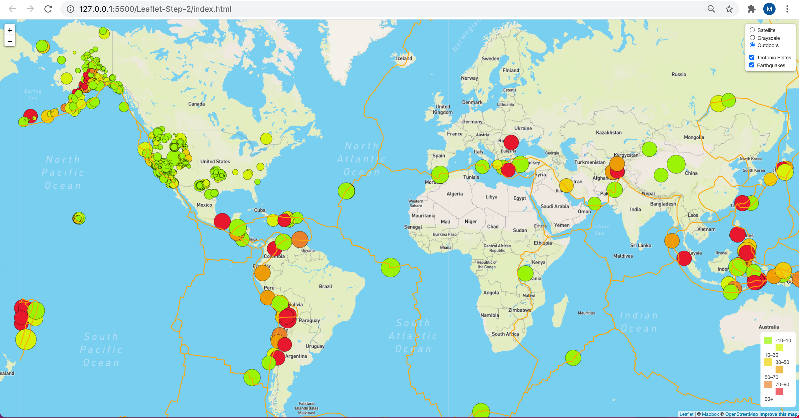

# Leaflet-challenge - Visiualizing Data with Leaflet

Welcome to the United States Geological Survey, or USGS for short! The USGS is responsible for providing scientific data about natural hazards, the health of our ecosystems and environment; and the impacts of climate and land-use change. Their scientists develop new methods and tools to supply timely, relevant, and useful information about the Earth and its processes. As a new hire, you will be helping them out with an exciting new project!

The USGS is interested in building a new set of tools that will allow them visualize their earthquake data. They collect a massive amount of data from all over the world each day, but they lack a meaningful way of displaying it. Their hope is that being able to visualize their data will allow them to better educate the public and other government organizations (and hopefully secure more funding..) on issues facing our planet.

## Level 1: Basic Visualization

1. ### Get your data set
&nbsp;&nbsp;&nbsp; The USGS provides earthquake data in a number of different formats, updated every 5 minutes. Visit the USGS GeoJSON Feed page and pick a data set to visualize. When you click on a data set, for example 'All Earthquakes from the Past 7 Days', you will be given a JSON representation of that data. You will be using the URL of this JSON to pull in the data for our visualization.

2. ### Import & Visualize the Data
A map was created using Leaflet that plots all of the earthquakes from your data set based on their longitude and latitude.

* The data markers should reflect the magnitude of the earthquake by their size and and depth of the earth quake by color. Earthquakes with higher magnitudes should appear larger and earthquakes with greater depth should appear darker in color.

* HINT the depth of the earth can be found as the third coordinate for each earthquake.

* Popups were included that provide additional information about the earthquake when a marker is clicked.

* A legend was created that will provide context for your map data.

## Level 2: More Data

A second data set was plotted on our map to illustrate the relationship between tectonic plates and seismic activity. You will need to pull in a second data set and visualize it along side your original set of data. Data on tectonic plates can be found at https://github.com/fraxen/tectonicplates.

The following steps were completed:

* Plot a second data set on our map.

* A number of base maps  was added to choose from as well as separate out our two different data sets into overlays that can be turned on and off independently.

* A layer controls  was added to our map.

